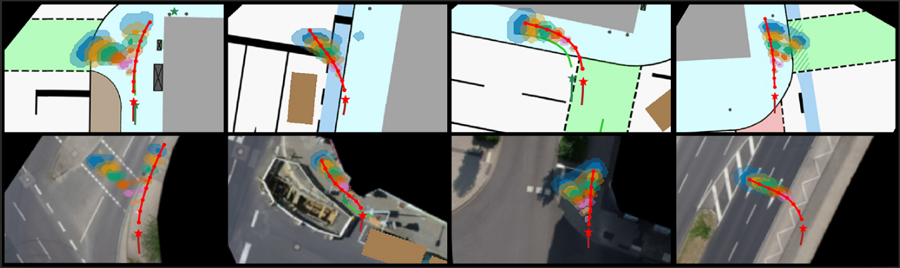
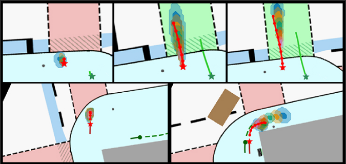

### Context-MDN: Context-aware Probabilistic Human Trajectory Forecasts for Autonomous Systems

|  | 
|:--:| 
|<p style="font-size: 10px;">Exemplary forecasting results of Context-MDN for different scenarios illustrated by top-view perspective. **Upper row** is using IMPTC dataset and **lower row** is using inD dataset. The target human agent is red, with the current location marked by a star and future positions as dots. Other agents are green. Vehicles are brown rectangles. Different colors represent forecasted residence areas for eight future timesteps (0.5, 1.0, 1.5, ... 4.0 s) and 95 % (more transparent) and 68 % (less transparent) confidence levels.</p>|

#### This is the official implementation for: 

_**Context-MDN: Context-aware Probabilistic Human Trajectory Forecasts for Autonomous Systems**_. 
Paper: [[arXiv]()] [[ResearchGate]()]

_**Abstract**_ --  Trajectory Forecasting is a challenging task in robotics, with numerous applications like Autonomous Driving, Smart City Surveillance, and Human-Machine Interaction. Modeling reliable and secure Human Trajectory Forecasts (HTF) is a challenging research topic due to the indeterminacy of human movements. Autonomous path planning depends on trustworthy forecasts and uncertainties to model multiple future scenarios and their probability of occurrence. Despite significant progress in recent years, probabilistic approaches often lack environmental context integration, modeling of multi-modality, and reliability calibration of forecasts. To this end, we propose a probabilistic HTF method called Context-MDN. The probabilistic forecast model integrates context data, uses uncertainty self-calibration, and offers the capability for multi-path forecasting, if necessary, considering the requirements of autonomous vehicles or robots. We demonstrate our method's performance using three datasets focusing on real-world applicability.


    @article{context_mdn,
        title={Context-MDN: Context-aware Probabilistic Human Trajectory Forecasts for Autonomous Systems},
        author={Hetzel, M. and Reichert, H. and Doll, K. and Sick, B.},
        journal={},
        year={2025},
        organization={},
        doi={}
    }

|  | 
|:--:| 
|<p style="font-size: 10px;">**Upper row, from left to right:** Anticipated starting movement due to a crosswalk signal change that is just taken place. **Lower row:** Two examples of an anticipated future stopping due to a red signalized crosswalk. On the right, the model is anticipating a stopping or an ongoing movement after the right turn.</p>|

---
### Table of contents:
* [Overview](#overview)
* [Requirements](#requirements)
* [Datasets](#datasets)
* [Pretrained Models](#pretrained)
* [Data Preprocessing](#prepro)
* [Training](#training)
* [Evaluation](#evaluation)
* [License](#license)

---
<a name="overview"></a>
### Overview
This repository contains all code, data and descriptions for the Paper: "Context-MDN: Context-aware Probabilistic Human Trajectory Forecasts for Autonomous Systems". The following chapters describe the necessary requirements to run our method, where to download our training and evaluation data, where to download pre-trained models and how to run the code yourself.


---
<a name="requirements"></a>
### Requirements

The framework uses the following system configuration. The exact python requirements can be found in the corresponding requirements.txt file.

```
# Software
Ubuntu 22.04 LTS
Python 3.10
Pytorch 2.5.0
CUDA 12.6
CuDNN 9.5
```

**Docker:**
If you want to use docker, we recommend the Nvidia NGC Pytorch 24.10 image: [[Info]](https://docs.nvidia.com/deeplearning/frameworks/pytorch-release-notes/rel-23-08.html) [[Docker Image]](https://catalog.ngc.nvidia.com/orgs/nvidia/containers/pytorch). Run the image and install the corresponding python requirements.txt and your ready to go.


---
<a name="datasets"></a>
### Datasets
We use pedestrian trajectory data from three popular road traffic datasets for our methods training and evaluation (inD, IMPTC, and SDD). For all datasets we extracted the raw pedestrians trajectories, applied a human-ego-centric coordinate system transformation as pre-processing, and subsampled the input- and output horizon data for training and evaluation. The four traffic related datasets are resampled to fixed 10.0 Hz sampling rate. Additional information (Papers/Code/Data) about all used datasets can be found below:

**IMPTC:** [[Paper]](https://ieeexplore.ieee.org/document/10186776) [[Data]](https://github.com/kav-institute/imptc-dataset)


**inD:** [[Paper]](https://ieeexplore.ieee.org/document/9304839) [[Data]](https://github.com/ika-rwth-aachen/drone-dataset-tools)


**SDD:** [[Paper]](https://link.springer.com/chapter/10.1007/978-3-319-46484-8_33) [[Data]](https://cvgl.stanford.edu/projects/uav_data/)


---
<a name="pretrained"></a>
### Pre-trained Models and Datasets
Pre-trained models and pre-processed training, eval and test data is provided within the table below.

| Dataset       | Models | Data | Status    |
|:-------------:|:---------------:|:-------------:|:---------:|
| All           | [[Download]]()             | [[Download]]()          | $${\color{red}coming soon}$$ |


---
<a name="prepro"></a>
### Data Preprocessing
coming soon


---
<a name="training"></a>
### Model Training
To run a training you can use the following command. All relevant information are provided by the configuration file. It contains all necessary paths, parameters and configurations for training and evaluation. For every dataset type one can create unlimited different configuration files.
```
# Start a training using IMPTC dataset and default config
main.py --target=imptc --configs=default_peds_imptc.json --gpu=0 --log --print

# Arguments:
--target: target dataset
--configs: target dataset specific config
--gpu: gpu id to be used for the training
--log: write training progress and feedback to log file
--print: show training progress and feedback in console
```


---
<a name="evaluation"></a>
### Model Evaluation
To run a model evaluation you can use the following command. The evaluation shares the config file with the training script.
```
# Start an evaluation for an IMPTC dataset trained model
testing.py --target=imptc --configs=default_imptc.json --gpu=0 --log --print

# Arguments:
--target: target dataset
--configs: target dataset specific config
--gpu: gpu id to be used for the evaluation
--log: write evaluation results to log file
--print: show evaluation results in console
```

**Pre-trained models:**
If you want to use a pre-trained model you must locate them into the correct subfolder structure: Starting at the defined "result_path" from the configuration file: 

```
# Structure:
"<result_path>/context_mdn/<target>/<config-file-name>/checkpoints/model_final.pt"

# Example for IMPTC:
"<result_path>/context_mdn/imptc/default_imptc/checkpoints/model_final.pt".
```

---
<a name="license"></a>
## License:
This project is licensed under the Apache 2.0 License - see the [LICENSE](LICENSE) file for details

---

## Contributors:

<a href="https://github.com/kav-institute/context_mdn_public/graphs/contributors">
  
</a>

Made with [contrib.rocks](https://contrib.rocks).

